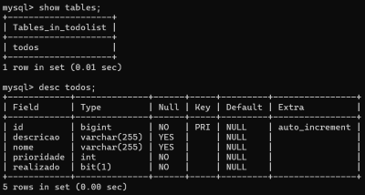

## To Do

### Sistema de gerenciamento de tarefas em Java

Desenvolvimento de uma aplicação web utilizando linguagem de programação Java
e framework SpringBoot de um sistema de `Gerenciamento de Tarefas` onde o usuário
poderá criar, visualizar, editar, excluir tarefas - **CRUD**.
#### Requisitos:
- Utilização de um banco de dados
- Campos mínimos da entidade tarefa: `nome`, `descricao`, `realizado` e `prioridade`
- Realizar CRUD das tarefas
#### Instruções
- Documentação
- Commits
___
### Adicionando MySql 
- Baixe o instalador do MySql no seguinte link 	[MySql Download](https://dev.mysql.com/downloads/installer/) e execute a instalação,
- Em seu computador execute o MySql Command Line Client,
- Acesse com as credenciais cadastradas na instalação,
- Execute os seguintes comandos: 
1. `create database todolist;`  para criar a base de dados,
2. `use todolist;` selecionando a base de dados criada,
3. `show tables;` conferindo que está vazia a base de dados,
- Retorne à IDE e execute o programa,
- No MySql Command Line execute novamente o comando `show tables;` 
confirmando a criação da tabela "todo".

